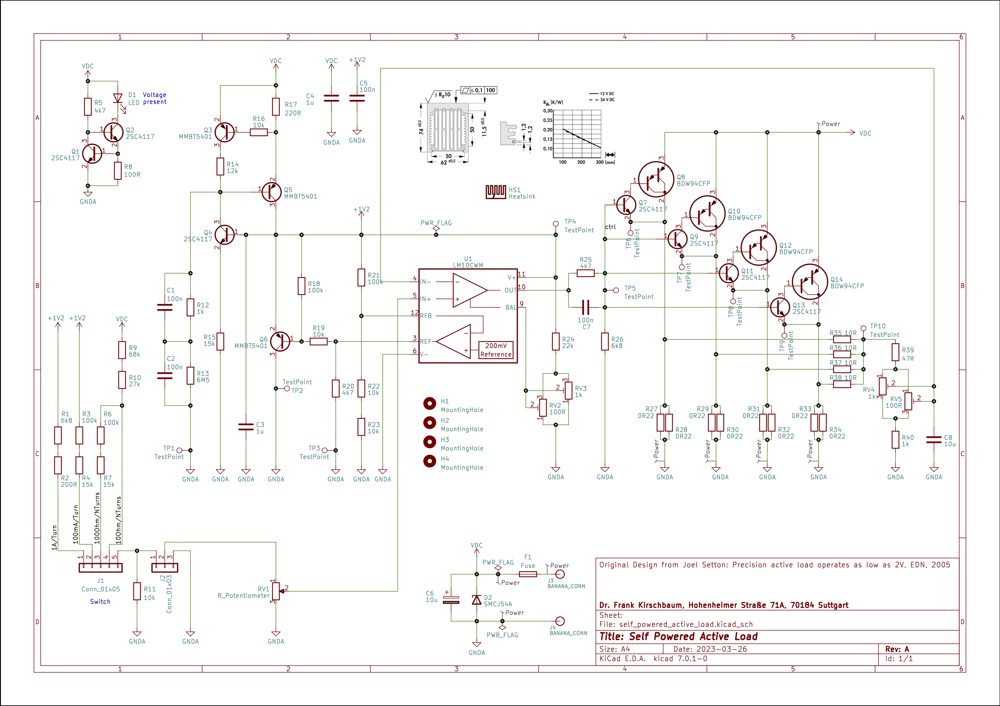
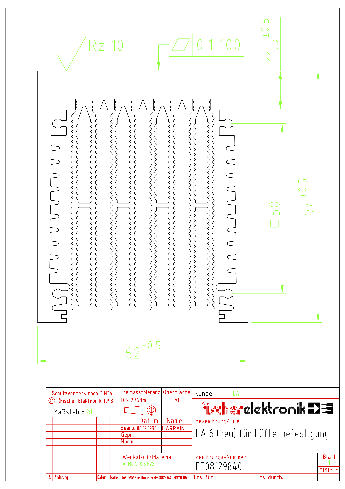
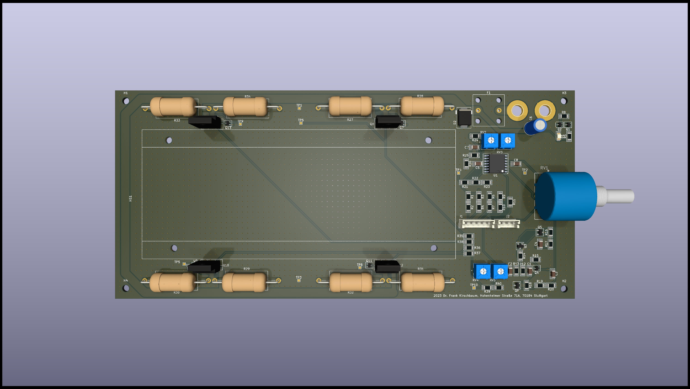

# self_powered_active_load

Self powered active load based on the legendary LM10 Operational Amplifier and Voltage Reference IC originally designed by Bob Widlar.

Independently of the applied voltage, the circuit composed by the transistors Q3, Q4, Q5, and Q6 generates a constant voltage of 1.2V to supply the LM10 controlled by the LM10 reference buffer itself. Thus, it is controlling its own supply voltage. Q3, Q4, and Q5 are composing a current mirror and Q6 is the final control element. This works down to an applied voltage of 2V. The transistors Q1 and Q2 are forming a constant current source to drive a power-on-LED independently from the applied voltage.

The main function of the circuit, the load current control, is done by the remaining precision operational amplifier. Four Sziklai-like output stages functions as final control elements for the current load.

For the heat to be dissipated, an appropriate heat sink is needed. Here the sink LA 6 from Fischer Elektronik with a length of 150mm is used. The sink can be optionally equipped with a fan. This can increases the maximum allowed power a lot.

The specs are roughly
- Voltage: It starts down at 2V and goes up to 60V, defined by one of the chosen transistors, specific the 2SC4117. It was chosen, because it has been available in my storage. Technically the upper border could be simply extended by using other transistors with higher maximum voltages. **But it's not recommended to leave the safe area of safety-low voltages**, in particular for amateurs. Stay always inside the field covered up by your knowledge and expierences!
- Max current: Each of the four Sziklai-like output stages with their shunt resistors can stand approx. 2.5A. Thus, overall 10A load current should be fine. For higher load currents the circuit can be scaled by adding more output stages.
- Max power: 30W without fan / 100W with fan

Production data, including the gerber files, can be found in the subfolder _production_. Or feel free to use the source files for your own projects.

The Circuit is mainly adopted from the source: Joel Setton; _Precision active load operates as low as 2V_, EDN, 2005. There's also a commercial version based on the same original circuit available: The TekBox TBOH02 self powered load.