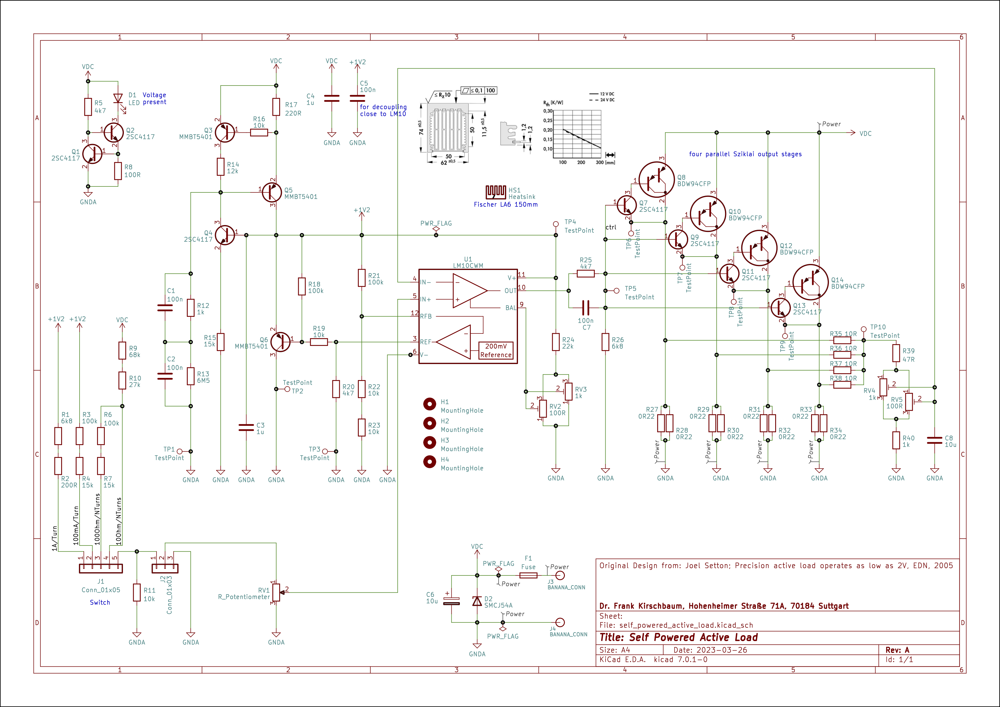

# self_powered_active_load

Self powered active load based on the legendary LM10 Operational Amplifier and Voltage Reference IC originally designed by Bob Widlar.

Circuit adopted from:
Joel Setton; Precision active load operates as low as 2V, EDN, 2005
